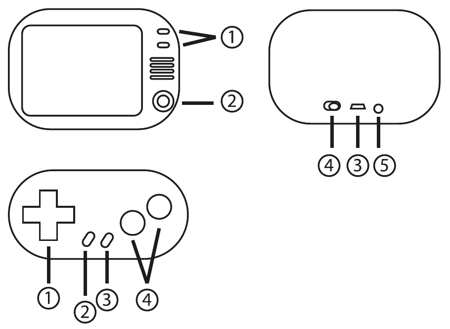

# User Manual – English Section (Orb "Retro Mini TV Handheld Console", OR-MINTVCNS)

This is a transcription of the English section of the manual filed with the FCC under
FCC ID 2ARNX8073. The source is the printer's artwork proof `DR-8073_manual_proof.pdf`
(title `OR-MINTVCNS_MANUAL_170519_OL REF`, artwork dated 17/05/2019). The text is in
outlined artwork, so it was transcribed from the rendered pages rather than extracted.
Wording, spelling and punctuation follow the original.

The original is a folded black-and-white leaflet, 90 × 120 mm when folded, with sections
in English (EN), French (FR), German (DE), Italian (IT) and Spanish (ES).

---

## Cover

> **orb™**
>
> **RETRO MINI TV HANDHELD CONSOLE**
>
> INSTRUCTIONS

---

## EN

### Mini TV

1. Reset buttons
2. Volume controller
3. DC 5V IN
4. ON/OFF switch
5. AV OUT

### Joypads

1. Direction Keys
2. Select button
3. Start button
4. A/B button

### Installing Batteries

Mini TV requires 3 x AAA batteries for Arcade Machine (not included)
Joypads require 2 x AG13 batteries each (included)

To insert the batteries into your Mini TV & joypads, unscrew the battery compartments and
install ensuring correct polarities.

### Connecting to your TV

It is possible to connect your Mini TV Console to a television for an enhanced experience.

1. Insert AV Cable (included) into the rear of your television ensuring the colour of each
   cable matches that seen on your television.
2. Insert the other end of the AV Cable into the rear of the Arcade Machine.

If your television does not include an AV input, it is possible to purchase an RF modulator
(available separately).

### Turning on your Arcade Machine

1. Turn your Mini TV Console ON using the power switch.
2. Refer to your televisions instruction manual if you are attempting to connect via an AV
   Cable.
3. Once on, select whether you would like to play a ONE or TWO player game by using the
   direction keys on one of the joypads.
4. Press Start to confirm.
5. Select the game you wish to play using the direction keys.
6. Press Start to confirm.
7. Press Reset at any time to return to the game selection screen or turn your console
   OFF/ON.
8. To turn your Mini TV Console OFF, move the Power Switch to the OFF position.

### Troubleshooting

1. No picture on LCD screen Is the Game Console turned on?
2. Are the batteries properly installed?
3. Check if the batteries are flat and need replacing.

**No sound:**
Is the volume control too low, or off?

**Picture on LCD screen is too dark:**
Check if the batteries are flat and need replacing.

**Fringes appear on LCD screen during broadcast & Picture is blinking or distorted:**

1. Check if the batteries are flat and need replacing.
2. Try pushing the reset button, if there are no improvement.
3. Switch the Game Console off and try again.

### Important: Please Read Before You Play

In very rare circumstances, some people may experience epileptic seizures when viewing
flashing lights or patterns in our ordinary daily environment. Flashing lights and patterns
will occur when using this product. Consult your physician before playing any video games if
you have had a epileptic condition, suffered a seizure or have experienced any of the
following when playing video games:

- Altered vision
- Eye or muscle twitching
- Mental confusion
- Disorientation
- Loss of awareness of your surroundings

### CAUTION

- Do not use rechargeable batteries.
- Do not attempt to recharge non-rechargeable batteries.
- Insert batteries to correct polarity as shown on the product.
- Do not mix old and new batteries.
- Do not mix different types of batteries.
- Always remove batteries from the product when not in use.

---

## Back panel

**Head Office - Thumbs Up (UK) Ltd**, Unit L, Braintree Industrial Estate, Ruislip,
Middlesex, HA4 0EJ, UK.
T: 0845 466 8880. info@thumbsupuk.com. www.thumbsupuk.com.

**Germany - Thumbs Up GmBh,** Rudolf-Diesel-Str.14, D-53859 Niederkassel.
T: +49(0)228 555 236-0. info@thumbsup.de. www.thumbsup.de

**USA - Thumbs Up USA**, Unit L, Braintree Industrial Estate, Ruislip, Middlesex, HA4 0EJ,
UK. T: 0845 466 8880. info@thumbsupusa.com. www.thumbsupusa.com

**orb™**

Designed in London by Thumbs Up (UK) Ltd.
Ruislip, HA4 0EJ, UK
© www.thumbsupuk.com

PART OF THE MAGNUM BRANDS GROUP

E&OE images and illustrations may differ from actual product.

MADE IN CHINA | FABRIQUÉ EN CHINE

**WARNING - CHOKING HAZARD**
Small parts not for children under 3 years.

Markings: CE, Green Dot, recycling symbol, WEEE crossed-out bin, FCC

OR-MINTVCNS

---

## FCC statement (page 2 of the filed PDF)

NOTE: This equipment has been tested and found to comply with the limits for a Class B
digital device, pursuant to part 15 of the FCC Rules. These limits are designed to provide
reasonable protection against harmful interference in a residential installation. This
equipment generates uses and can radiate radio frequency energy and, if not installed and
used in accordance with the instructions, may cause harmful interference to radio
communications. However, there is no guarantee that interference will not occur in a
particular installation. If this equipment does cause harmful interference to radio or
television reception, which can be determined by turning the equipment off and on, the user
is encouraged to try to correct the interference by one or more of the following measures:

- Reorient or relocate the receiving antenna.
- Increase the separation between the equipment and receiver.
- Connect the equipment into an outlet on a circuit different from that to which the
  receiver is connected.
- Consult the dealer or an experienced radio/TV technician for help

Changes or modifications not expressly approved by the party responsible for compliance
could void the user's authority to operate the equipment.

This device complies with Part 15 of the FCC Rules. Operation is subject to the following
two conditions:

1. this device may not cause harmful interference, and
2. this device must accept any interference received, including interference that may cause
   undesired operation.

---

## Notes (not part of the manual)

- **No pairing instructions.** The manual never mentions wireless pairing. This fits a
  controller link that pairs automatically at power-on.
- **The cover shows wired joypads.** The cover drawing shows joypads with cables, but the
  product and the FCC filing are wireless. The artwork was probably reused from a wired
  version.
- **"Arcade Machine" appears several times.** The manual calls the unit an "Arcade Machine"
  in several places ("3 x AAA batteries for Arcade Machine", "Turning on your Arcade
  Machine"). This suggests the text was adapted from Thumbs Up's Orb Retro Mini Arcade
  Machine manual, which shares the same 216 one-player + 84 two-player game pack.
- **AG13 = LR44.** AG13 is another name for the LR44 alkaline button cell. The "TV Classic"
  box describes it as "LR 44 mercury battery".
- **"Mini TV" item 1 is two buttons.** The two small buttons beside the screen are both
  labelled "Reset buttons". On the main PCB these are the RESET and START tact switches.
